# Operation Ira

Challenge difficulté difficile à extrême ayant pour but de reproduire des comportements de criminels sur internet et illustrer des pivots moins connus en OSINT.

C'est parti !

## Contexte

Nous avons découvert qu'un candidat a mis en vente les rushes d’un film devant être projeté au Festival de Cannes.

Dans un tweet, il explique vouloir se venger du réalisateur qui s’est mal comporté pendant le tournage en mettant en vente, au plus offrant,  les rushes de son film.

Un acheteur semble avoir été trouvé. Votre mission est de  l'identifier. Nous disposons uniquement du compte X du candidat qui  précise que l’achat se fera uniquement en cryptomonnaies...

Enquêtez et retrouvez cet acheteur : nous cherchons à obtenir son nom, son prénom ainsi que son modèle de téléphone.

Compte X du candidat : @FilmOnChain

Format du flag : : SHLK{prenom-nom_modele-de-telephone}

Exemple : SHLK{eric-dupont_galaxy-s22}

### Compte X

Un compte X est renseigné dans le challenge, sur ce compte, il y a le tweet suivant :

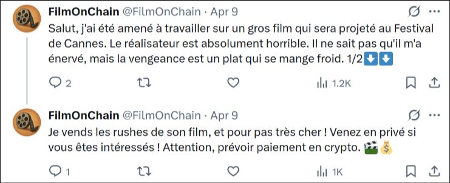

Visiblement, il en a gros sur la patate. Son tweet a une réponse ! 

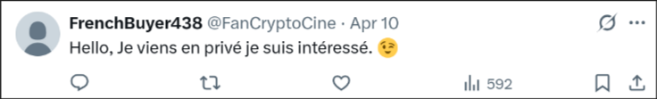

Et toc ! Visiblement on a notre acheteur ! 

Sur son compte, il n'y a rien de tres intéressant sauuuuuuf : 

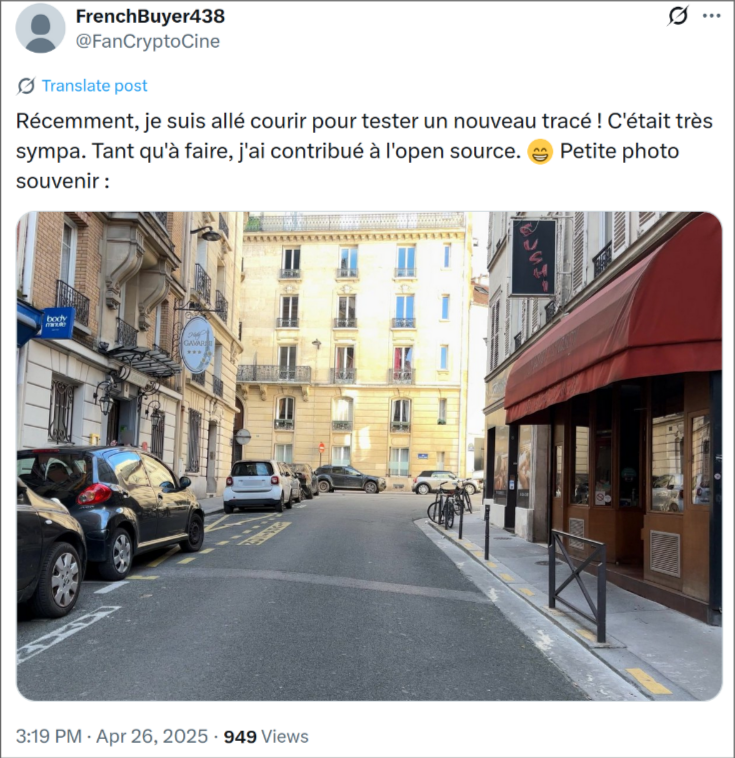

Donc visiblement notre mechant acheteur est un coureur et il publie ses trajet quelque part sur internet !

Deja, essayons de voir ou est-ce qu'il court !

Essayez de trouver un élément identifiable !

Et oui ! Vous l'avez : 

On voit l'"hôtel Gavarni" qui est rue Gavarni dans le 16eme arrondissement.

Cherchons où publier des photos pour **"contribuer à l'open source"**. Évidemment, il n’y a rien sur Google Maps. Il faut donc regarder les alternatives existantes. Ici, la photo se retrouve sur **KartaView**.
 Sachez qu’il était aussi possible de demander à ChatGPT la liste des alternatives à Google Street View, et hop, vous aviez le site facilement (c’est quand même pratique, l’IA…).

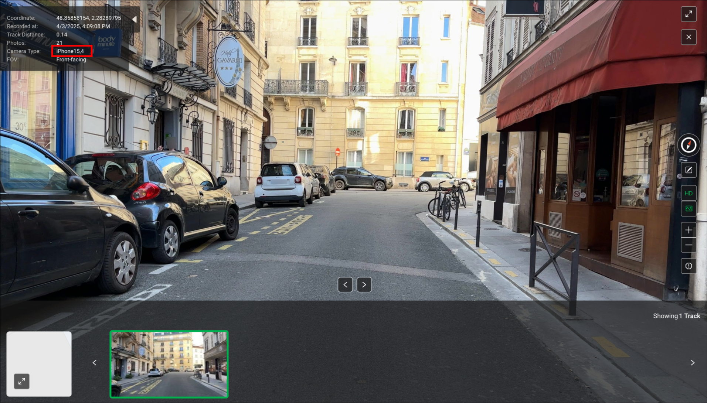

Et voilà, on retrouve notre photo, et même le téléphone utilisé. On a donc la deuxième partie de notre flag : **iphone-15**.

L’idée ici était de faire découvrir **KartaView**, qui est une super alternative à Google Maps, car cela permet d’avoir des photos des rues à des intervalles très courts ! Dans les grandes villes, il peut y avoir plusieurs photos par semaine !

### Cool mais ensuite ?

Maintenant, il nous faut l’identité de l’acheteur ! Il n’y a pas plus d’infos à son sujet… Nulle part… (du moins, à ma connaissance).
 On va donc retourner voir notre vendeur pour voir si cela peut nous permettre de remonter vers notre acheteur plus tard.

Sur le compte X du vendeur, il y a un lien vers son compte Gitea. Gitea est une plateforme de partage de code (comme GitHub). Sur son profil Gitea (StormP3p1t0), on trouve un seul projet assez petit avec 2 commits. En regardant l’historique des commits, on voit :

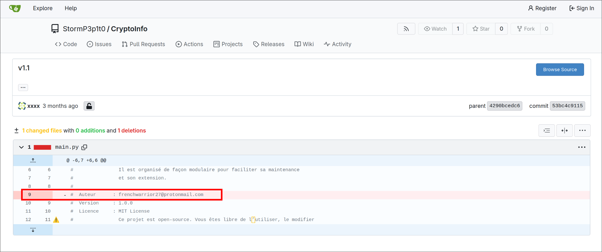

Le mail **frenchwarrior27@protonmail.com** a été supprimé du code initial !
 Voilà un bon élément pour pivoter !

Ce mail n’est inscrit nulle part ailleurs, sinon ce serait trop facile (du moins, il n'était inscrit nulle part avant que les joueurs ne l'inscrive partout, mais bon).

En revanche, il s’agit d’un compte ProtonMail. ProtonMail est souvent utilisé car il a la réputation d’être respectueux de la vie privée. Mais ce n’est pas tout ! Il utilise aussi un système de chiffrement des mails. Comment ça fonctionne ? Lors de l’envoi d’un mail à un utilisateur Proton, ProtonMail récupère la clé publique du destinataire et s’en sert pour chiffrer le contenu du mail. Ensuite, le destinataire peut lire le mail grâce à la clé privée présente sur son compte.

À la création du compte, cette paire de clés est générée par ProtonMail, mais l’utilisateur peut choisir d’utiliser sa propre paire de clés (comme ça, il n’y a pas besoin de faire confiance aux clés générées par Proton).

Par définition, les clés publiques sont 🥁🥁🥁 publiques !
 Il est donc possible de récupérer la clé publique d’un utilisateur !

En se rendant ici :
 https://api.protonmail.ch/pks/lookup?op=index&search=frenchwarrior27@protonmail.com

On récupère les informations relatives à la clé publique de notre vendeur.
 (Petite astuce : remplacez **"index"** par **"get"** dans l’URL pour télécharger la clé publique.)

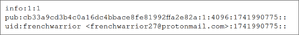

Après **"pub"**, on trouve le fingerprint (l’identifiant) de la clé.

La toute dernière valeur (1741990775) correspond au timestamp de l’ajout de la clé au compte. C’est une deuxième technique gratos : puisque quasiment personne ne met ses propres clés sur Proton, cette date correspond à la date de génération des clés par Proton, et donc très souvent à l’instant précis de la création du compte !

Bref, revenons à nos moutons : que faire de cette clé publique ?
Et bien, si sa clé publique est réutilisée sur un autre site, il sera possible de trouver un autre compte lui appartenant.

Si on se renseigne sur comment faire de l’OSINT avec les clés PGP, on tombe sur cet article :
 https://nixintel.info/osint-tools/using-pgp-keys-for-osint/.

On y trouve différentes techniques, comme chercher sur keys.openpgp.org, mais pour nous, pas de résultat !

Par contre, le site **Keybase** est évoqué. Il s’agit d’un site qui permet de communiquer (chat, partage de fichiers, etc.) en utilisant ses propres clés PGP.
 Voyons si la clé publique de notre vendeur se trouve sur Keybase :

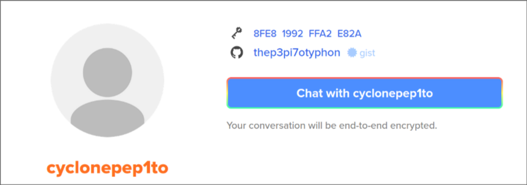

Effectivement ! En entrant le fingerprint sur Keybase, on tombe sur le profil de **cyclonepep1to**.

Le but de cette partie est de montrer que tout élément réutilisé entre deux comptes permet de les lier, que ce soit des choses évidentes comme des usernames, des photos de profil ou des bannières, mais aussi les clés publiques !

Un compte GitHub est lié à son Keybase, alors direction GitHub !

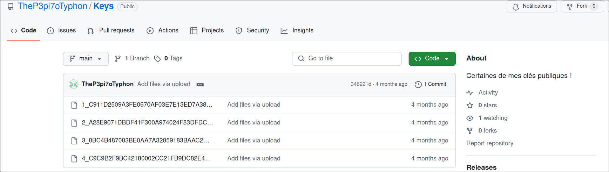

Il possède un repo nommé **"Keys"** contenant certaines de ses clés publiques.

Ici, le but était de montrer une autre technique classique d’OSINT sur les clés publiques : lors de la génération des clés PGP, un username et un mail sont demandés (ces informations sont purement déclaratives).
 Bien souvent, les utilisateurs ignorent que les informations fournies lors de la génération sont stockées dans la clé publique.

Utilisons un site en ligne pour voir le contenu d’une clé publique PGP, par exemple :
 https://cirw.in/gpg-decoder/

On y colle notre clé pour vérifier s’il y a des informations importantes cachées

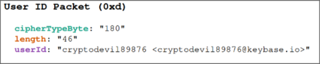

En effet, dans la clé "3_8BC4B487083BE0AA7A32859183BAAC2A8BB97ED7.asc" on trouve le mail "cryptodevil89876@keybase.io"

Bon, vu le nom de domaine : on teste ce username dans keybase etttttttt : 

Effectivement, un compte existe avec ce pseudo. Ce compte a dans sa bio un compte DMOJ, qui est un site de challenge de programmation. 

En cliquant sur le profil DMOJ, nous trouvons ceci : 

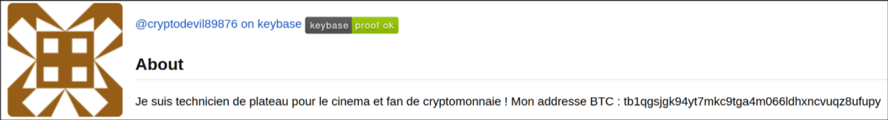

Et voila ! On retrouve son adresse BTC ! Et ca c'est une good news !

Vous l'aurez compris, le but de ces pivots etait d'explorer l'OSINT sur les clés publiques et differents sites utiles dans ce contexte.

## Direction la blockchain BTC

*Le but de cette partie est de montrer au joueur comment faire de l’OSINT sur une blockchain et comment remonter un petit mixage. Cette partie montre aussi qu’il y a plusieurs manières de résoudre un problème et que, pour gagner du temps, il ne faut pas hésiter à faire des scripts que l’on peut garder dans le temps. Le but est également de pousser l’utilisateur à faire des schémas et à prendre des notes de ses trouvailles.*

Bon, pour recapituler : Dans cette description, nous apprenons que le vendeur des rushes est en fait un technicien de plateau ! Également, nous trouvons son adresse Bitcoin. L’avantage de la blockchain Bitcoin, c’est que toutes les transactions sont publiques. Ainsi, nous pouvons regarder les fonds reçus par son adresse après la publication de son tweet. Il y a de fortes chances pour que l’adresse qui envoie des fonds soit celle de l’acheteur. 

Il existe de très nombreux sites capables de fournir les détails des transactions sur la blockchain Bitcoin. Attention, ici, nous sommes sur la Testnet (reconnaissable car l’adresse commence par « t »), certains sites ne sont pas compatibles avec le testnet. 

Nous allons utiliser https://mempool.space/ pour analyser les transactions. 

En regardant les fonds reçus par cette adresse, nous voyons ceci : 

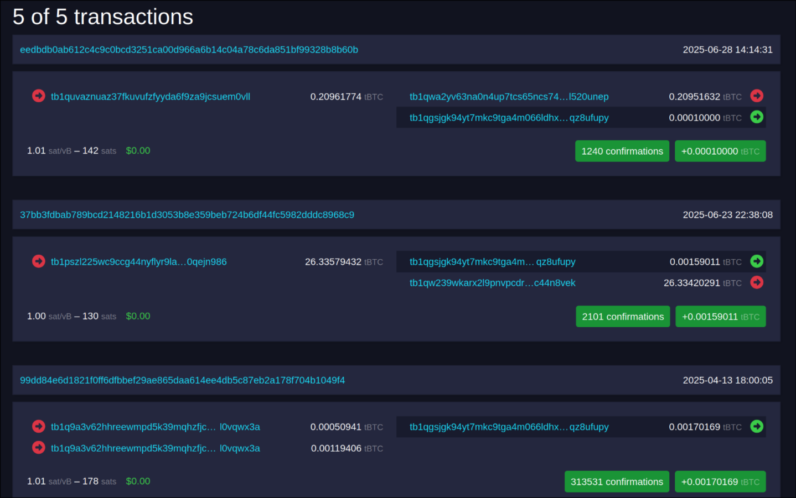

L’adresse n’a reçu que 5 transactions, toutes à un intervalle très court et dans la periode de la vente. Il est probable que ces virements soient issus de la même vente. Simplement, pour éviter de se faire retracer, les criminels n’envoient pas les fonds directement d’une adresse à une autre. Ils vont utiliser différentes adresses intermédiaires pour acheminer les fonds et essayer de brouiller les pistes. Ce procédé s’appelle un “mixage”. 

Si l’on regarde en détail l’adresse « tb1q9a3v62hhreewmpd5k39mqhzfjck9fsl0vqwx3a » qui a envoyé des fonds, on voit ceci : 

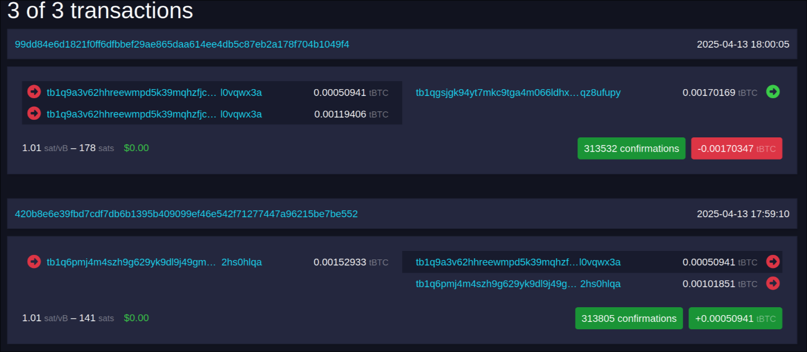

Elle a reçu des fonds et elle les a renvoyés presque instantanément (moins d'une minute). Il en va de même pour les autres adresses. De plus, on constate que les adresses s’envoient des fonds entre elles. Cela semble bien être un mixage. 

## Remontons ce mixage !

Pour remonter un mixage, il faut noter chaque intermédiaire et leurs interactions. En effet, ces adresses reçoivent de l’argent et le renvoient. Cependant, cet argent est bien arrivé là car quelqu’un a fait un virement avec son adresse. Le but est donc de remonter les relations entre les adresses et de trouver quelle adresse est à l’origine de l’argent utilisé ensuite. 

Pour cela, il est possible de faire un schéma relationnel. Ce schéma peut être fait à la main ou avec un site permettant de faire des graphes/schémas. Un excellent site pour faire des graphes d’OSINT est OsintTracker : [https://app.osintracker.com](https://app.osintracker.com/). Il permet de cartographier nos trouvailles durant une enquête d’OSINT (comptes sur les réseaux sociaux, adresses BTC, ...). 

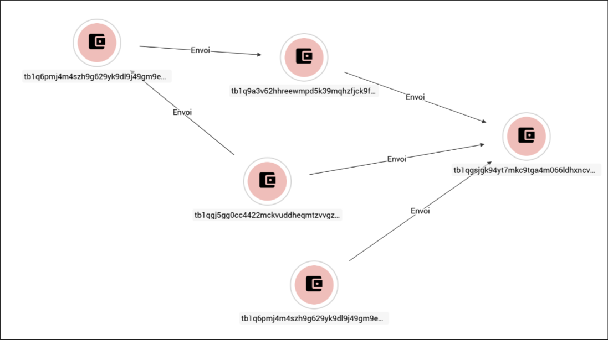

Voilà le début de notre mixage, on peut continuer cela à la main !
 Il est **HYPER IMPORTANT** de tout noter et de bien tout cartographier dans une enquête d’OSINT conséquente.
 Vraiment, la méthodologie, c’est **SUPER** important !

### On remonte jusqu'où ?

Il faut continuer le processus jusqu’à trouver l’adresse à l’origine des fonds, ou une information permettant de pivoter.
Il est important de vérifier le montant des fonds envoyés ou reçus par les adresses. Lorsque les fonds sont achetés auprès d’un exchange, une adresse appartenant à cet exchange vire les fonds ; ces adresses manipulent souvent des milliers de BTC.
Lorsqu’on tombe sur un compte ayant manipulé de telles sommes, il y a fort à parier qu’il s’agisse d’un exchange, et donc que le destinataire de la transaction soit la personne qui a acheté les fonds !
 Le site https://www.walletexplorer.com/ permet aussi de savoir si une adresse appartient à un exchange ou non.

Ici, je vais proposer une solution alternative pour remonter très rapidement le mixage grâce à quelques lignes de Python.
Il est pratique de se constituer une base de scripts permettant de faciliter les tâches répétitives d’OSINT afin de gagner du temps.

Un outil puissant pour gérer des graphes est Neo4j. Avec le module Python **py2neo**, il est possible de gérer très facilement des graphes.
Pas de panique si vous n’êtes pas à l’aise en programmation, c’est le genre de petits scripts que votre modèle de LLM préféré pourra générer facilement.

Nous allons donc récupérer les adresses impliquées dans une transaction grâce à l’API de MemPool.
Nous allons ajouter un lien entre deux adresses. Pour chaque adresse inconnue, nous l’ajoutons à la liste des adresses à analyser, et nous regardons aussi avec qui elle a interagi.

Mon script est dispo ici (c'est un poc un peu nul mais ca a le merite d'exister).

On lance le script : 

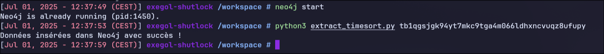 

On obtient le graphe suivant :

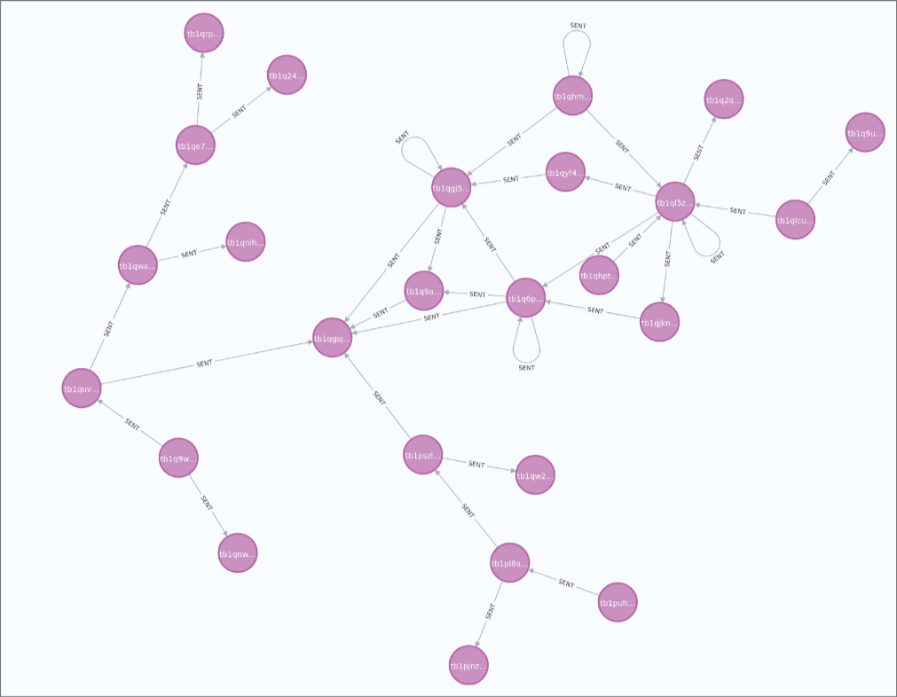

Notre graphe ne fait que quelques nœuds et s’arrête après avoir croisé une adresse ayant manipulé plusieurs BTC. (un exchange). 

Nous voyons que les adresses se parlent principalement entre elles. Également, en regardant en détail, on voit que les adresses ont envoyé les fonds reçus quelques secondes après leur réception, elles ont juste servi d’intermédiaires. Nous allons donc disposer le graphe pour voir quelle adresse a d’abord reçu des fonds d’un exchange avant d’envoyer les fonds vers d’autres adresses ; elle sera notre source. 

Notre script va également numéroter les noeuds en fonction de la date de la transaction. Nous disposons nos noeuds avec a gauche la transaction la plus recente et a droite la plus ancienne (Vous pouvez lire de droite à gauche en suivant les flèches).

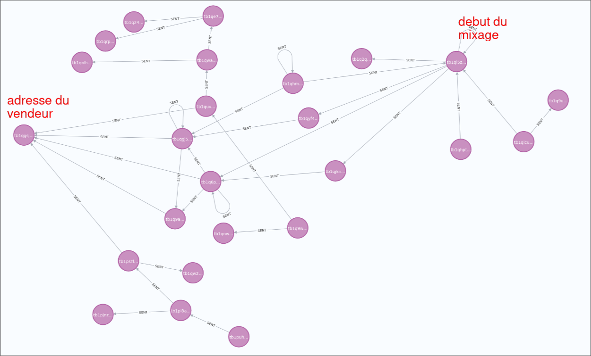

On a donc l'adresse qui a lance le mixage : "tb1ql5zlsvtqu2l0xj9gjyln92rd24nqskwrtse45l" 

Elle a ete alimentée par l'adresse "tb1qlcum23lllg9jn3muwrz7p8k8vvlszrukxc3m84" elle meme alimentée via "tb1q005r7xr7s8h77a9xvs97lexvhjncft0rxqhlr7". Si on regarde les details de cette transactions, on a : 

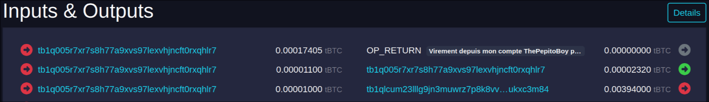

On trouve que dans les métadonnées (il faut toujours regarder les métadonnées, même sur les blockchains !) de la transaction qui a alimenté le compte, il est écrit « Virement depuis mon compte ThePepitoBoy pour le mixage ». Donc, son compte d’origine est « tb1q005r7xr7s8h77a9xvs97lexvhjncft0rxqhlr7 » et il a envoyé les fonds à une nouvelle adresse dont il s’est servi pour lancer le mixage. 

Super ! On a pu remonter le mixage de acheteur a notre vendeur et on peut désormais pivoter vers notre acheteur car on a un nom d'utilisateur ! 

Nous avons créé un script Python capable de remonter un (petit) mixage sur la blockchain Bitcoin. Tout cela pouvait etre fait a la main mais ici j'essaie de montrer des techniques différentes. Pour rappel, il est important d’automatiser certaines tâches pouvant servir dans plusieurs investigations. 

### Direction Reddit 

*Cette partie montre que souvent, les criminels se protègent sur internet et sont prudents, leur entourage, lui, est beaucoup moins prudent. Beaucoup se font arrêter après des posts de leurs proches*

On trouve que ce nom d’utilisateur est lié au compte Reddit de quelqu’un qui parle de cinéma.

 

Sur ce post, un ami qu’il semble connaître dans la vraie vie lui dit qu’il n’est plus très actif. On en déduit donc qu'ils sont sur une appli de course ! La plus connue est Strava donc testons et puis Strava a été au cœur d’une grande enquête OSINT cette année après les révélations par *Le Monde* qu’il était possible de savoir où aller dormir le chef d’État en déplacement grâce aux activités Strava de son groupe de sécurité. 

### Enfin la fin !

**ThePepitoBoy** n’existe pas sur Strava, il fait attention à sa vie privée et utilise un pseudo différent à chaque fois.

En revanche, **"IronVador 7793"** existe sur Strava. Il explique sur Reddit qu’il peut voir son ami sur l’application, ils doivent donc être en relation sur Strava.
 Vous noterez l’espace entre **"IronVador"** et **"7793"** : c’est parce que Strava utilise le format "prénom nom". Copier-coller **IronVador7793** de Reddit dans Strava ne donne rien.

En effet, lors d’enquêtes, il est très important d’éviter de copier-coller des noms d’utilisateurs tels quels, car cela restreint immédiatement votre recherche et peut vous faire passer à côté d’éléments importants ! Par exemple, s’il s’était appelé **IronVador7794**, vous ne l’auriez jamais trouvé !

Alors qu’en tapant simplement **"IronVador"**, son profil apparaît directement dans les suggestions. (Et hop, petit tip en plus !)

En regardant les courses des amis d’**IronVador7793**, on trouve un ami nommé **"PythonFrench91"**, ce qui est plutôt rare sur Strava.

Regardons l'activite de **PythonFrench91** :

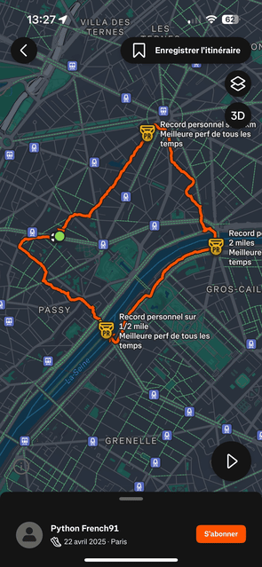

Et ou court-il ? :

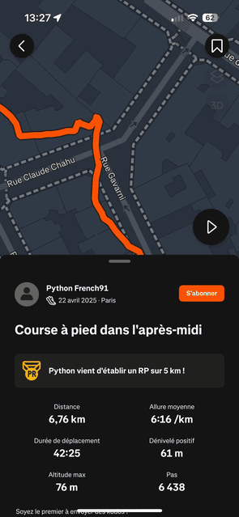

**"PythonFrench91"** court rue Gavarni dans le 16ᵉ arrondissement, comme notre acheteur d’après son compte Twitter !

Notre acheteur est donc **"PythonFrench91"**, ou plutôt **Theodore Coulombe**, d’après son compte Instagram !

### Le flag 🎉🎉🎉

On obtient donc le flag **SHLK{theodore-coulombe_iphone-15}**

Bravo aux 4 personnes ayant fini le challenge !

Merci à tous ceux qui l’ont fait ou qui ont lu ce write-up, j’espère que vous aurez appris des choses !

À bientôt !
